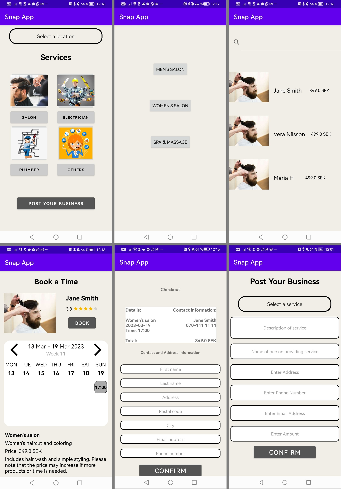

<h1 align="center">Native Android application for the posting and booking of services. </h1>

The frontend uses Retrofit to send and recieve data to and from a <a href="https://github.com/lehtihet/SnapApp-Backend">RESTful Spring Boot</a> backend which was hosted on Heroku. (Since the backend is no longer online, this app won't show populated data, instead see the image preview.)

## Features

- **Lets customers view a broad range of offered services**
- **Compare and see reviews of different service providers witin a service category**
- **Select and book a time for a service**
- **Post your own service to be available through the app**

## About

This app along with the [Spring Boot backend](https://github.com/lehtihet/SnapApp-Backend) was developed as a part of [Developing Mobile Applications](https://www.kth.se/student/kurser/kurs/ID2216?l=en) at KTH. 

